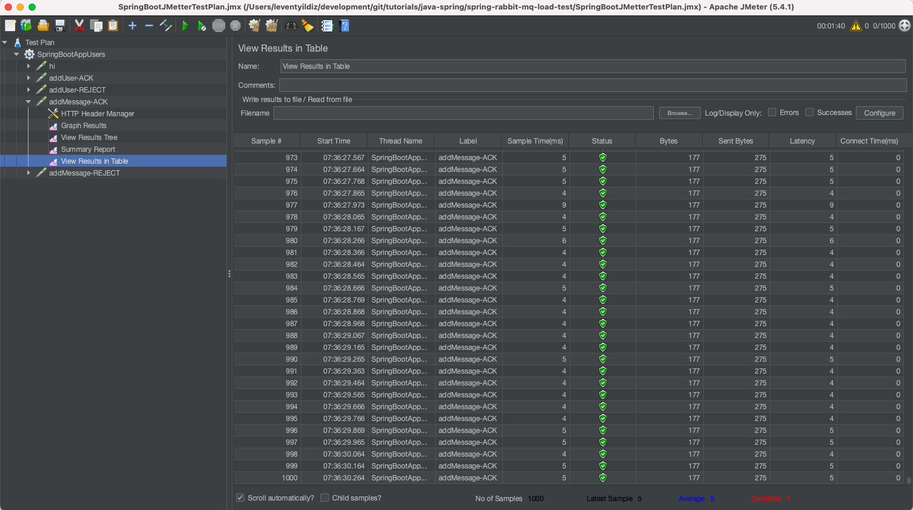

### Açıklama 
- Bu çalışmada Spring üzerinden RabbitMQ'ya gönderilen mesajların ulaşıp ulaşmadığı incelenmiştir.
- Manual Ack ve Nack işlemi yapılan bir çalışmadır.
- Lokal makinede JMeter ile eş zamanlı 1000 bağlantının test sonucu gözlemlenmiştir.
- RabbitMQ kurulumu ve Sprgin ile impelementasyonu aşağıdaki adresdedir. 
[index için tıklayın](../spring-rabbit-mq-example/README.md)
- JMetter ayarları için aşağıdaki adres incelenebilir.
https://howtodoinjava.com/java/library/jmeter-beginners-tutorial/

### Configration eklenmesi
RabbitMQ congiurasyonu **RabbitMQConfiguration.java** adlı dosyadadır.

### Ack confirm eklenmesi
Mesajların confirm edilip edilmediği **com.demo.service.RabbitMQService.sendDataToMQService(...)** methodunda  aşağıdaki şekilde kontrol edilmiştir.
```
confirm = correlationData.getFuture().get(sendMessageAckResponseTimeout, TimeUnit.SECONDS);
if (!confirm.isAck()) {
    log.error("An error occured! Ack is not confirmed. Data could not sent to the RabbitMQ, data:{}", data);
}
```


methodun tamamı:
```
private void sendDataToMQService(Object data, CorrelationData correlationData) {
    log.info("data is sending...");
    this.rabbitTemplate.convertAndSend(exchangeName, routngKey, data, correlationData);
    log.info("convert and send called!");
    Confirm confirm;
    try {
        confirm = correlationData.getFuture().get(sendMessageAckResponseTimeout, TimeUnit.SECONDS);
        if (!confirm.isAck()) {
            log.error("An error occured! Ack is not confirmed. Data could not sent to the RabbitMQ, data:{}", data);
        }
    } catch (InterruptedException e) {
        log.error("The process is not completed! data could not sent to the RabbitMQ, data:{}  e: {}",
                data, e);
    } catch (ExecutionException e) {
        log.error("An error occured! data could not sent to the RabbitMQ, data:{}  e: {}", data, e);
    } catch (TimeoutException e) {
        log.error("Request time out! data could not sent to the RabbitMQ, data:{}  e: {}", data, e);
    }
    log.info("data is sent.");
}
```

### Queue adına göre listenerların eklenmesi
application.properties deki queue adına göre listener aşağıdaki şekilde oluşturulur.
```
@RabbitListener(queues = "${rabbitmq.queue.name}")
```

listener class'ının tamamı
```
@Component
@Slf4j
@RabbitListener(queues = "${rabbitmq.queue.name}")
public class RabbitMQListenerService {
    
    @RabbitHandler
    public void messageListener(MessageData data, Channel channel, Message message) throws IOException {
        log.info("Message from RabbitMQ : {}", data);

        if (data.getId() > 100) {
            channel.basicAck(message.getMessageProperties().getDeliveryTag(), false);
            return;
        }

        if (data.getId() == 0) {
            channel.basicReject(message.getMessageProperties().getDeliveryTag(), false);
            return;
        }

        //requeue
        channel.basicNack(message.getMessageProperties().getDeliveryTag(), false, true);
    }

    @RabbitHandler
    public void userMessageListener(UserData data, Channel channel, Message message) throws IOException {
        log.info("User from RabbitMQ : {}", data);

        if (data.getId() > 100) {
            channel.basicAck(message.getMessageProperties().getDeliveryTag(), false);
            return;
        }

        if (data.getId() == 0) {
            channel.basicReject(message.getMessageProperties().getDeliveryTag(), false);
            return;
        }

        //requeue
        channel.basicNack(message.getMessageProperties().getDeliveryTag(), false, true);
    }
}
```

### CURL örneği (Manual User ACK)
 ```
$ curl -X POST "http://localhost:8080/users" -H "accept: */*" -H "Content-Type: application/json" -d "{ \"id\": 123, \"name\": \"Jhon\", \"age\": 20, \"email\": \"aa@bb.cc \"}"
```
 
### CURL örneği (manual Message ACK)
 ```
$ curl -X POST "http://localhost:8080/messages" -H "accept: */*" -H "Content-Type: application/json" -d "{ \"id\": 123, \"name\": \"Test Message 123\", \"description\": \"Here is description123 \"}"
```
 
### CURL örneği(manual Message NACK)
 ```
$ curl -X POST "http://localhost:8080/messages" -H "accept: */*" -H "Content-Type: application/json" -d "{ \"id\": 12, \"name\": \"Test Message 12\", \"description\": \"Here is description12 \"}"
```
 
### CURL örneği(manual Message REJECT)
 ```
$ curl -X POST "http://localhost:8080/messages" -H "accept: */*" -H "Content-Type: application/json" -d "{ \"id\": 0, \"name\": \"Test Message 12\", \"description\": \"Here is description12 \"}"
```
 
### JMetter
üstteki CURL komutları **SpringBootJMetterTestPlan.jmx** dosyasında eş zamanlı **1000** request atılacak şekilde eklenmiştir.

